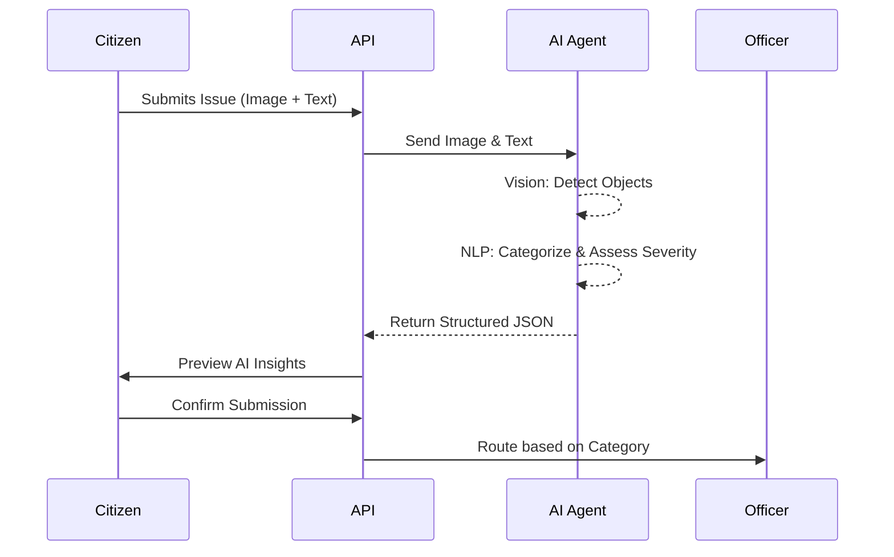

# AI Workflow

Community Hero AI leverages multi-agent AI to automate triage, estimation, and routing.

## AI Processing Pipeline

## AI Capabilities

- **Computer Vision:** Detects potholes, garbage, broken infrastructure from uploaded images.
- **Multilingual Support:** Translates non-English descriptions into English seamlessly.
- **Severity Scoring:** Automatically determines Priority (Low, Medium, High, Critical).
- **Cost Estimation:** Generates rough estimates of repair costs for admin dashboards.
- **Smart Routing:** Assigns issues to relevant municipal departments (e.g., Water Board, Traffic).
