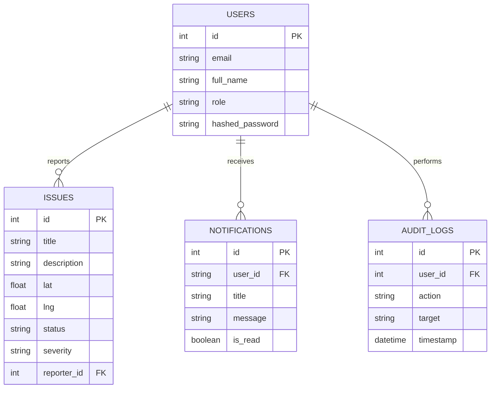

# Database Schema

Community Hero AI uses a PostgreSQL relational database. The schema is optimized for speed, relationships, and extensibility.

## Entity Relationship Diagram

## Tables Overview

- **Users:** Stores citizen, officer, and admin accounts. Includes RBAC rules.
- **Issues:** The core entity representing a community problem. Stores geolocation (lat, lng), AI analysis metadata, and current status.
- **Notifications:** Tracks in-app and email notifications.
- **Audit Logs:** Immutable record of sensitive actions for security compliance.
