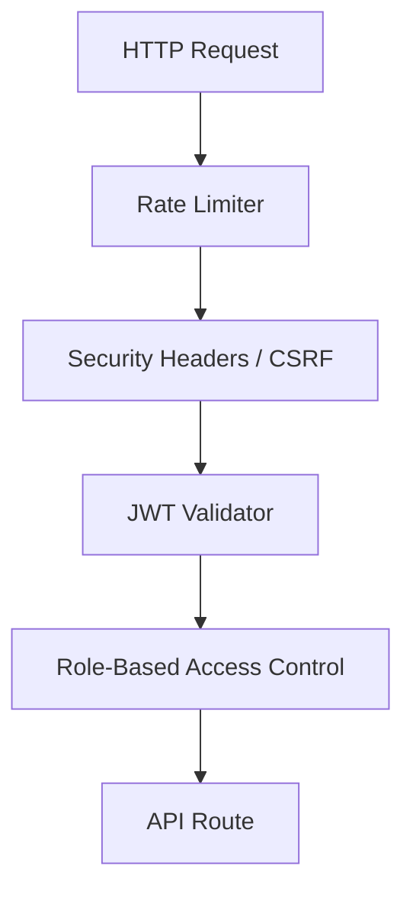

# Security Overview

Security is built into every layer of Community Hero AI, ensuring data protection and zero-trust authentication.

## Security Controls

## Key Mechanisms
1. **Passwords:** Hashed using Argon2id.
2. **Tokens:** JWTs are issued for sessions with a short expiry.
3. **Data Protection:** Personal Identifiable Information (PII) is sanitized before being passed to AI agents.
4. **Prompt Injection Guard:** AI inputs are sanitized to prevent jailbreaking or malformed system prompt overriding.
5. **Audit Logging:** Every administrative action is logged immutably in the database.
