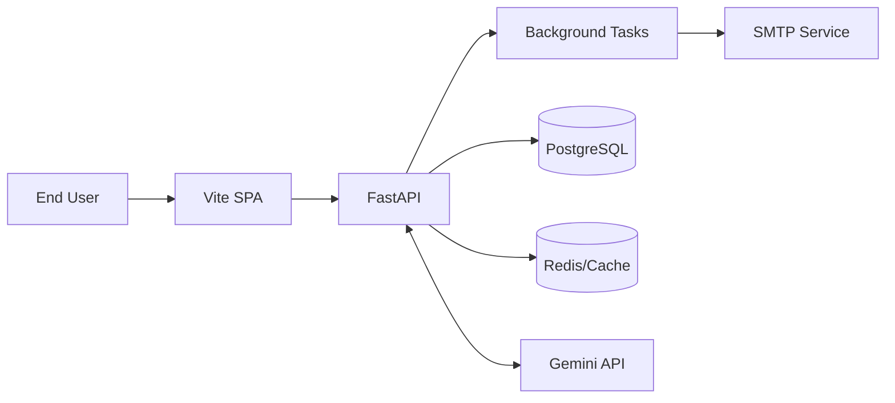

# System Design

Community Hero AI is designed for high availability, fast time-to-interactivity (TTI), and scalability.

## Data Flow

## Modular Structure
- **Frontend Modules:** Dashboard, Leaderboard, Map, Authentication, Issues, Admin.
- **Backend Services:** AI processing, RBAC/Auth, Email service, Analytics aggregation, WebSocket manager.
- **Background Tasks:** Used extensively in FastAPI for offloading email dispatching and AI heavy lifting.
